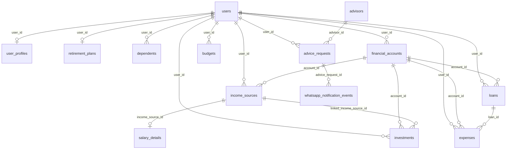

# Database schema

Drizzle definitions live in [`src/schema/`](src/schema/). This file lists **every table, every column**, and **every foreign key**.

Money columns are `numeric(14,2)` (INR). Rate columns are `numeric(8,4)`. Identity IDs are `varchar` UUIDs unless noted as `serial` / `integer`.

---

## How tables connect (foreign keys)

| From table | From column | To table | To column | Cardinality | ON DELETE |
|---|---|---|---|---|---|
| `user_profiles` | `user_id` (PK) | `users` | `id` | 1:1 | CASCADE |
| `retirement_plans` | `user_id` (PK) | `users` | `id` | 1:1 | CASCADE |
| `dependents` | `user_id` | `users` | `id` | N:1 | CASCADE |
| `financial_accounts` | `user_id` | `users` | `id` | N:1 | CASCADE |
| `income_sources` | `user_id` | `users` | `id` | N:1 | CASCADE |
| `income_sources` | `account_id` | `financial_accounts` | `id` | N:1 optional | SET NULL |
| `salary_details` | `income_source_id` (PK) | `income_sources` | `id` | 1:1 | CASCADE |
| `loans` | `user_id` | `users` | `id` | N:1 | CASCADE |
| `loans` | `account_id` | `financial_accounts` | `id` | N:1 optional | SET NULL |
| `expenses` | `user_id` | `users` | `id` | N:1 | CASCADE |
| `expenses` | `loan_id` | `loans` | `id` | N:1 optional | SET NULL |
| `expenses` | `account_id` | `financial_accounts` | `id` | N:1 optional | SET NULL |
| `budgets` | `user_id` | `users` | `id` | N:1 | CASCADE |
| `investments` | `user_id` | `users` | `id` | N:1 | CASCADE |
| `investments` | `account_id` | `financial_accounts` | `id` | N:1 optional | SET NULL |
| `investments` | `linked_income_source_id` | `income_sources` | `id` | N:1 optional | SET NULL |
| `advice_requests` | `user_id` | `users` | `id` | N:1 | CASCADE |
| `advice_requests` | `advisor_id` | `advisors` | `id` | N:1 optional | SET NULL |
| `whatsapp_notification_events` | `advice_request_id` | `advice_requests` | `id` | N:1 | CASCADE |
| `login_activities` | `user_id` | `users` | `id` | N:1 | CASCADE |

**No foreign keys:** `sessions`, `advice_settings`.

**Logical join (no FK):** `budgets.category` matches `expenses.category` for the same `user_id`.

---

## `users`

Login identity only. File: [`auth.ts`](src/schema/auth.ts). Expenses, income, investments, loans, budgets, and retirement inputs live in the tables below — not as JSON on this row.

| Column | Type | Null | Default | Notes |
|---|---|---|---|---|
| `id` | varchar PK | no | `gen_random_uuid()` | Hub for almost all FKs |
| `email` | varchar UNIQUE | yes | | |
| `password_hash` | varchar | yes | | Legacy credential hash; no longer accepted for consumer sign-in |
| `email_verified_at` | timestamp | yes | | Last successful email proof |
| `profile_image_url` | varchar | yes | | OIDC picture |
| `full_name` | varchar(100) | yes | | |
| `date_of_birth` | date | yes | | Used in retirement math |
| `gender` | varchar(32) | yes | | |
| `phone` | varchar(24) | yes | | |
| `onboarding_completed` | boolean | no | `false` | |
| `created_at` | timestamp | no | IST now | |
| `updated_at` | timestamp | no | IST now | |

---

## `sessions`

| Column | Type | Null | Default | Notes |
|---|---|---|---|---|
| `sid` | varchar PK | no | | Cookie / bearer token |
| `sess` | jsonb | no | | Includes embedded `user` |
| `expire` | timestamp | no | | Indexed `IDX_session_expire` |

Not referenced by other tables.

## `email_otp_challenges`

Short-lived email verification attempts. Codes are stored only as keyed hashes.

| Column | Type | Null | Default | Notes |
|---|---|---|---|---|
| `id` | varchar PK | no | UUID | Public challenge identifier |
| `email` | varchar(320) | no | | Normalized address |
| `requester_hash` | varchar(64) | no | | Keyed network hash for abuse limits |
| `code_hash` | varchar(64) | no | | HMAC-SHA256; never plaintext |
| `expires_at` | timestamp | no | | Ten-minute validity |
| `delivered_at` | timestamp | yes | | Set only after provider acceptance |
| `consumed_at` | timestamp | yes | | Set atomically on success |
| `failed_attempts` | integer | no | `0` | |
| `max_attempts` | integer | no | `5` | |
| `resend_available_at` | timestamp | no | | Per-address throttle |
| `created_at` | timestamp | no | IST now | |

---

## `login_activities`

Successful sign-ins only. A daily scheduled purge removes records older than 90 days, with audit writes and admin history reads providing defense-in-depth cleanup. IP addresses are not stored.

| Column | Type | Null | Default | Notes |
|---|---|---|---|---|
| `id` | varchar PK | no | UUID | |
| `user_id` | varchar FK → `users.id` | no | | CASCADE |
| `auth_method` | varchar(16) | no | | `email_otp` or `oidc` |
| `device_type` | varchar(32) | yes | | Bounded User-Agent classification |
| `browser` | varchar(80) | yes | | Bounded User-Agent classification |
| `operating_system` | varchar(80) | yes | | Bounded User-Agent classification |
| `country` | varchar(2) | yes | | Approximate Vercel geography |
| `region` | varchar(100) | yes | | Approximate Vercel geography |
| `city` | varchar(100) | yes | | Approximate Vercel geography |
| `created_at` | timestamp | no | IST now | Login time |

---

## `user_profiles`

1:1 extra person fields. File: [`finance.ts`](src/schema/finance.ts).

| Column | Type | Null | Default | Notes |
|---|---|---|---|---|
| `user_id` | varchar PK, FK → `users.id` | no | | CASCADE |
| `risk_preference` | varchar(24) | no | `Balanced` | Conservative / Balanced / Growth |
| `ui_preferences` | jsonb | no | `{}` | Card order and sort mode for investments/loans |
| `preferred_currency` | varchar(3) | no | `INR` | |
| `country` | varchar(2) | no | `IN` | |
| `pan` | varchar(10) | yes | | Unused in UI |
| `marital_status` | varchar(32) | yes | | Unused in UI |
| `city` | varchar(80) | yes | | Unused in UI |
| `state` | varchar(80) | yes | | Unused in UI |
| `pincode` | varchar(12) | yes | | Unused in UI |
| `created_at` | timestamp | no | IST now | |
| `updated_at` | timestamp | no | IST now | |

---

## `retirement_plans`

1:1 planning assumptions.

| Column | Type | Null | Default | Notes |
|---|---|---|---|---|
| `user_id` | varchar PK, FK → `users.id` | no | | CASCADE |
| `target_retirement_age` | integer | no | `55` | |
| `life_expectancy` | integer | no | `85` | |
| `general_inflation_pct` | numeric(8,4) | no | `6` | |
| `salary_growth_pct` | numeric(8,4) | no | `8` | Fallback when income has no own growth |
| `monthly_contribution_override` | numeric(14,2) | yes | | |
| `invest_surplus` | boolean | no | `false` | |
| `created_at` | timestamp | no | IST now | |
| `updated_at` | timestamp | no | IST now | |

---

## `dependents`

N:1 household members. **No UI yet.**

| Column | Type | Null | Default | Notes |
|---|---|---|---|---|
| `id` | varchar PK | no | `gen_random_uuid()` | |
| `user_id` | varchar FK → `users.id` | no | | CASCADE, indexed |
| `relationship` | varchar(32) | no | | spouse, child, parent, other |
| `full_name` | varchar(160) | no | | |
| `date_of_birth` | date | yes | | |
| `dependent_until_age` | integer | yes | | |
| `notes` | text | no | `''` | |
| `created_at` | timestamp | no | IST now | |
| `updated_at` | timestamp | no | IST now | |

---

## `financial_accounts`

N:1 bank / broker / EPF accounts. **No UI yet.** Optional parent of income, loans, expenses, investments.

| Column | Type | Null | Default | Notes |
|---|---|---|---|---|
| `id` | varchar PK | no | `gen_random_uuid()` | |
| `user_id` | varchar FK → `users.id` | no | | CASCADE, indexed |
| `account_type` | varchar(24) | no | `bank` | bank, broker, epf, nps, ppf, wallet, other |
| `name` | varchar(160) | no | | |
| `institution` | varchar(160) | no | `''` | |
| `account_last4` | varchar(4) | yes | | Masked only |
| `ifsc` | varchar(16) | yes | | |
| `is_primary` | boolean | no | `false` | |
| `metadata` | jsonb | no | `{}` | |
| `created_at` | timestamp | no | IST now | |
| `updated_at` | timestamp | no | IST now | |

---

## `income_sources`

| Column | Type | Null | Default | Notes |
|---|---|---|---|---|
| `id` | varchar PK | no | `gen_random_uuid()` | |
| `user_id` | varchar FK → `users.id` | no | | CASCADE, indexed |
| `account_id` | varchar FK → `financial_accounts.id` | yes | | SET NULL |
| `name` | varchar(160) | no | `''` | |
| `type` | varchar(40) | no | `Other` | Salary, Rental, … |
| `frequency` | varchar(24) | no | `Monthly` | Monthly, Annual, One-time |
| `amount` | numeric(14,2) | no | `0` | |
| `date` | varchar(40) | no | `''` | Client date string |
| `recurring` | boolean | no | `true` | |
| `annual_growth_rate` | numeric(8,4) | yes | | |
| `income_end_mode` | varchar(16) | no | `retirement` | `retirement` or `custom` |
| `income_end_date` | date | yes | | Inclusive end month when mode is `custom` |
| `notes` | text | no | `''` | |
| `created_at` | timestamp | no | IST now | |
| `updated_at` | timestamp | no | IST now | |

---

## `salary_details`

1:1 CTC breakdown for a salary income source.

| Column | Type | Null | Default | Notes |
|---|---|---|---|---|
| `income_source_id` | varchar PK, FK → `income_sources.id` | no | | CASCADE |
| `gross_ctc` | numeric(14,2) | no | `0` | API: `grossCTC` |
| `gross_ctc_mode` | varchar(16) | no | `manual` | `automatic` or `manual`; legacy CTC remains manual |
| `basic_pay` | numeric(14,2) | no | `0` | |
| `hra` | numeric(14,2) | no | `0` | |
| `allowances` | numeric(14,2) | no | `0` | |
| `employee_pf` | numeric(14,2) | no | `0` | API: `employeePF` |
| `professional_tax` | numeric(14,2) | no | `0` | |
| `tds` | numeric(14,2) | no | `0` | |
| `tds_mode` | varchar(16) | no | `manual` | `automatic` or `manual`; legacy TDS remains manual |
| `tax_regime` | varchar(8) | yes | | `new` or `old` |
| `financial_year` | varchar(16) | yes | | Financial year used for TDS |
| `tax_rule_version` | varchar(64) | yes | | Versioned rule set used for TDS |
| `other_deductions` | numeric(14,2) | no | `0` | |

---

## `loans`

| Column | Type | Null | Default | Notes |
|---|---|---|---|---|
| `id` | varchar PK | no | `gen_random_uuid()` | |
| `user_id` | varchar FK → `users.id` | no | | CASCADE, indexed |
| `account_id` | varchar FK → `financial_accounts.id` | yes | | SET NULL |
| `type` | varchar(32) | no | `Other` | Home, Auto, Personal, Education, Other |
| `name` | varchar(160) | no | `''` | |
| `sanctioned_principal` | numeric(14,2) | no | `0` | |
| `outstanding_principal` | numeric(14,2) | no | `0` | |
| `annual_interest_rate` | numeric(8,4) | no | `0` | |
| `interest_type` | varchar(16) | no | `Floating` | Fixed / Floating |
| `total_tenure_months` | integer | no | `0` | |
| `start_date` | varchar(40) | no | `''` | |
| `emi` | numeric(14,2) | no | `0` | |
| `prepayments` | numeric(14,2) | no | `0` | Running total |
| `notes` | text | no | `''` | |
| `created_at` | timestamp | no | IST now | |
| `updated_at` | timestamp | no | IST now | |

---

## `expenses`

| Column | Type | Null | Default | Notes |
|---|---|---|---|---|
| `id` | varchar PK | no | `gen_random_uuid()` | |
| `user_id` | varchar FK → `users.id` | no | | CASCADE |
| `loan_id` | varchar FK → `loans.id` | yes | | SET NULL; API `linkedLoanId` |
| `account_id` | varchar FK → `financial_accounts.id` | yes | | SET NULL |
| `date` | varchar(40) | no | `''` | Indexed with `user_id` |
| `amount` | numeric(14,2) | no | `0` | |
| `category` | varchar(80) | no | `''` | Indexed with `user_id`; matches budgets |
| `merchant` | varchar(160) | no | `''` | |
| `payment_method` | varchar(80) | no | `''` | |
| `note` | text | no | `''` | |
| `reimbursable` | boolean | no | `false` | |
| `recurring` | boolean | no | `false` | |
| `created_at` | timestamp | no | IST now | |
| `updated_at` | timestamp | no | IST now | |

---

## `budgets`

| Column | Type | Null | Default | Notes |
|---|---|---|---|---|
| `id` | varchar PK | no | `gen_random_uuid()` | |
| `user_id` | varchar FK → `users.id` | no | | CASCADE |
| `category` | varchar(80) | no | | Unique with `user_id` |
| `monthly_limit` | numeric(14,2) | no | `0` | |
| `updated_at` | timestamp | no | IST now | |

---

## `investments`

| Column | Type | Null | Default | Notes |
|---|---|---|---|---|
| `id` | varchar PK | no | `gen_random_uuid()` | |
| `user_id` | varchar FK → `users.id` | no | | CASCADE, indexed |
| `account_id` | varchar FK → `financial_accounts.id` | yes | | SET NULL |
| `linked_income_source_id` | varchar FK → `income_sources.id` | yes | | SET NULL; salary EPF |
| `name` | varchar(160) | no | `''` | |
| `asset_class` | varchar(40) | no | `Other` | Indexed with `user_id` |
| `invested_amount` | numeric(14,2) | no | `0` | |
| `current_value` | numeric(14,2) | no | `0` | |
| `quantity` | numeric(8,4) | yes | | |
| `average_buy_price` | numeric(14,2) | yes | | |
| `monthly_contribution` | numeric(14,2) | yes | | |
| `auto_managed_contribution` | boolean | no | `false` | |
| `expected_return` | numeric(8,4) | no | `0` | Percent |
| `ticker` | varchar(40) | yes | | |
| `folio` | varchar(80) | yes | | |
| `institution` | varchar(160) | yes | | |
| `interest_rate` | numeric(8,4) | yes | | |
| `account_number` | varchar(80) | yes | | |
| `maturity_date` | varchar(40) | yes | | |
| `notes` | text | no | `''` | |
| `details` | jsonb | no | `{}` | Sparse: `unit`, `location`, `area` |
| `created_at` | timestamp | no | IST now | |
| `updated_at` | timestamp | no | IST now | |

---

## `advice_settings`

Singleton product config. File: [`advice.ts`](src/schema/advice.ts).

| Column | Type | Null | Default | Notes |
|---|---|---|---|---|
| `id` | integer PK | no | `1` | Always the one settings row |
| `consultation_fee` | integer | no | `99` | |
| `currency` | varchar(3) | no | `INR` | |
| `business_whatsapp` | varchar(24) | no | `''` | |
| `upi_id` | varchar(160) | no | `''` | |
| `updated_at` | timestamp | no | IST now | |

---

## `advisors`

| Column | Type | Null | Default | Notes |
|---|---|---|---|---|
| `id` | serial PK | no | | Integer, not UUID |
| `name` | varchar(160) | no | | |
| `credentials` | text | no | `''` | |
| `bio` | text | no | `''` | |
| `specialties` | text[] | no | `{}` | |
| `languages` | text[] | no | `{}` | |
| `availability` | text | no | `''` | |
| `whatsapp` | varchar(24) | no | | |
| `phone` | varchar(24) | no | `''` | |
| `booking_url` | text | no | `''` | |
| `photo_url` | text | no | `''` | |
| `active` | boolean | no | `true` | |
| `created_at` | timestamp | no | IST now | |
| `updated_at` | timestamp | no | IST now | |

---

## `advice_requests`

| Column | Type | Null | Default | Notes |
|---|---|---|---|---|
| `id` | serial PK | no | | |
| `user_id` | varchar FK → `users.id` | no | | CASCADE |
| `user_name` | varchar(160) | no | | Copied at submit |
| `user_email` | varchar(320) | no | `''` | Copied at submit |
| `whatsapp_number` | varchar(24) | no | | |
| `topic` | varchar(32) | no | | |
| `note` | text | no | `''` | |
| `consent` | boolean | no | | |
| `fee_amount` | integer | no | `99` | |
| `payment_status` | varchar(24) | no | `pending` | |
| `payment_reference` | varchar(160) | yes | | |
| `payment_submitted_at` | timestamp | yes | | |
| `status` | varchar(24) | no | `submitted` | |
| `advisor_id` | integer FK → `advisors.id` | yes | | SET NULL |
| `created_at` | timestamp | no | IST now | |
| `updated_at` | timestamp | no | IST now | |

Unique: one active request per user (`status` not `completed` / `cancelled`).

---

## `whatsapp_notification_events`

File: [`whatsapp.ts`](src/schema/whatsapp.ts).

| Column | Type | Null | Default | Notes |
|---|---|---|---|---|
| `id` | serial PK | no | | |
| `advice_request_id` | integer FK → `advice_requests.id` | no | | CASCADE |
| `event_type` | varchar(32) | no | | Unique with request id |
| `status` | varchar(16) | no | `pending` | |
| `attempt_count` | integer | no | `1` | |
| `provider_message_id` | varchar(160) | yes | | |
| `error` | text | yes | | |
| `created_at` | timestamp | no | IST now | |
| `last_attempt_at` | timestamp | no | IST now | |
| `completed_at` | timestamp | yes | | |

---

## Indexes (non-PK)

| Table | Index | Columns |
|---|---|---|
| `sessions` | `IDX_session_expire` | `expire` |
| `login_activities` | `login_activities_created_idx` | `created_at` |
| `login_activities` | `login_activities_user_created_idx` | `user_id`, `created_at` |
| `dependents` | `dependents_user_id_idx` | `user_id` |
| `financial_accounts` | `financial_accounts_user_id_idx` | `user_id` |
| `income_sources` | `income_sources_user_id_idx` | `user_id` |
| `loans` | `loans_user_id_idx` | `user_id` |
| `expenses` | `expenses_user_date_idx` | `user_id`, `date` |
| `expenses` | `expenses_user_category_idx` | `user_id`, `category` |
| `budgets` | `budgets_user_category_unique` | `user_id`, `category` UNIQUE |
| `investments` | `investments_user_id_idx` | `user_id` |
| `investments` | `investments_user_asset_class_idx` | `user_id`, `asset_class` |
| `advice_requests` | `advice_requests_one_active_per_user` | `user_id` + partial status |
| `whatsapp_notification_events` | `whatsapp_notification_request_event_unique` | `advice_request_id`, `event_type` UNIQUE |
